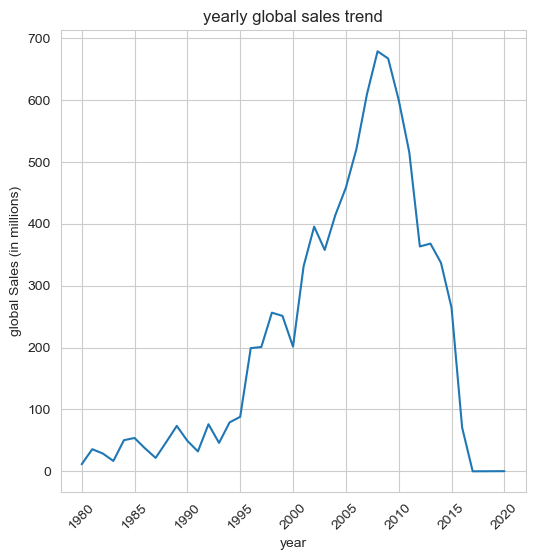
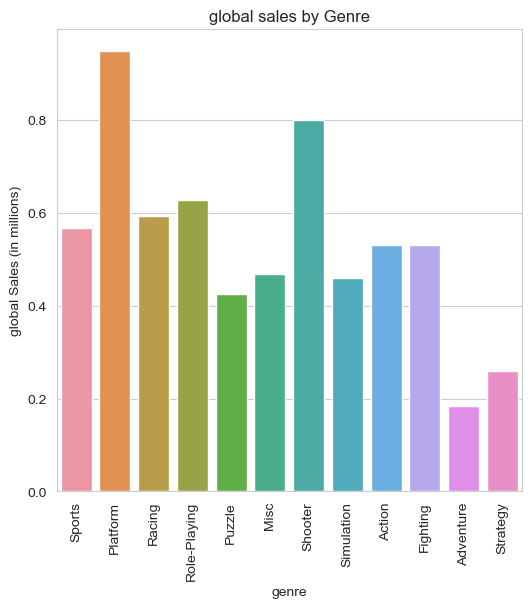
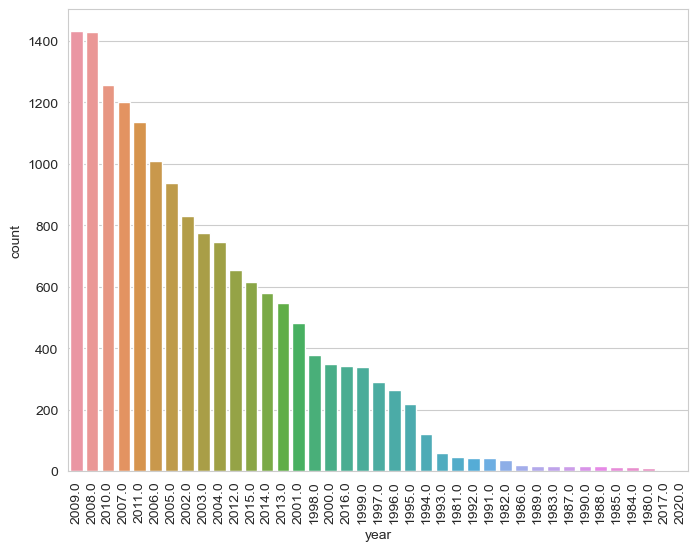

# Analysis Video Game Sales 

## About the Project
This project analyzes video game sales data to explore trends across different regions, genres, and platforms.
The objective is to provide insights into the gaming industry using data analysis and visualization techniques.

## Tools and Libraries
- Python 3
- Pandas
- NumPy
- Matplotlib
- Seaborn
- Jupyter Notebook

## Key Analysis
- Best-selling games globally and by region
- Trends by year of release
- Popular genres and platforms
- Correlation between critic/user scores and sales

## Project Structure
```
Analysis-Video-Game-Sales-Molight-Night
 ┣ Analyzing_Video_Game_Sales_Data.ipynb   # Jupyter Notebook with code and analysis
 ┣ README.md                                # Project documentation
 ┣ requirements.txt                         # Python libraries required
 ┗ images/                                  # Folder containing generated charts
```

## How to Run
1. Clone this repository:
   ```bash
   git clone https://github.com/USERNAME/Analysis-Video-Game-Sales-Molight-Night.git
   ```
2. Install dependencies:
   ```bash
   pip install -r requirements.txt
   ```
3. Open the notebook in Jupyter or VS Code:
   ```bash
   jupyter notebook Analyzing_Video_Game_Sales_Data.ipynb
   ```

## Requirements
Content of `requirements.txt`:
```
pandas
numpy
matplotlib
seaborn
```

## Sample Visualizations

### Yearly Global Sales Trend


### Global Sales by Genre


### Global Sales by Platform



## Author
Fadiah Suleiman Alanzi
Data Science Graduate
